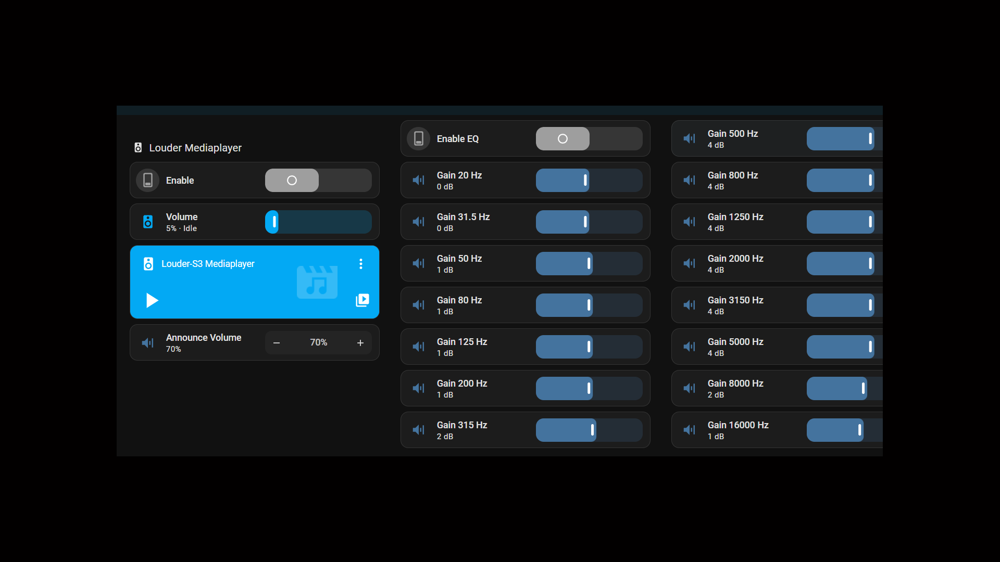

## ESPHome component for ESP32-Louder (using ESP32-S3 with PSRAM and TAS5805m DAC)

This ESPHome external component is based on the TAS5805M DAC driver for ESP32 platform<BR>
https://github.com/sonocotta/esp32-tas5805m-dac/tree/main by Andriy Malyshenko<BR>
which is licenced under GNU GENERAL PUBLIC LICENSE Version 3, 29 June 2007.


## Usage: Tas5805m component
This component requires Esphome version 2025.2.0 or later.

The following yaml can be used so ESPHome accesses the component files:
```
external_components:
  - source: github://mrtoy-me/esphome-components-test@dev
    components: [ tas5805m ]
    refresh: 0s
```

# Example configuration entry
The component configuration uses the esphome Audio DAC Core component,<BR>
so it is configured as a platform under the core audio dac component.

```
audio_dac:
  - platform: tas5805m
    enable_pin: GPIOxx
    analog_gain: -14.5db
```
***enable_pin:*** is required and is the enable pin of ESP32-Louder<BR>
***analog_gain:*** is optional with a default value of -15.5db<BR>
The analog gain must be a number between -15.5db and 0db in 0.5db increments.<BR>
If 5v is used to power the ESP32S3 Louder board then the default setting of -15.5db is recommended.<BR>

# YAML examples in this Repository
Esp-idf framework can be used for defining the mediaplayer.

The "esp32S3_louder_idf_media.yaml" provides and example configuration.<BR>
This configurationuses more use of psram and has two audio pipelines - media and announce.<BR>
Volume control and mute/unmute are undertaken by the tas5805m dac. This example reduces the volume of the media pipeline<BR>
if the announce pipeline plays and also adjusts the announce pipeline volume, then reverts back when the announce audio pipeline stops.<BR>
The announce pipeline volume used can be altered through a number template which can be adjusted in Homeassistant.<BR>
EQ control is setup through Enable Eq Control switch and several number templates.<BR>

To control via Homeassistant, quite a few cards need to be defined. The example dashboard view configuration "HA_dashboard_view_setup.yaml"<BR>
can be used to setup a dashboard. The following setup assumes you have used "esp32S3_louder_idf_media.yaml" configuration<BR>
and Homeassistant version 2025.5.0 is used so entity naming is the same as in "HA_dashboard_view_setup.yaml".<BR>

Undertake the following steps....<BR>
Create a new dashboard by going to "Settings" then "Dashboards", add a new Dashboard and give it a Title.<BR>
A single view called Home will be created on this new dashboard. Go to edit mode for that dashboard by pressing the top right Pencil icon,<BR>
then using the top right 3 dots icon menu, select Raw configuration editor. Copy and paste the contents of "HA_dashboard_view_setup.yaml"<BR>
over the second line "- title: Home" and press save, then cross out and press Done.<BR>

Now you should have a dashboard view that looks like this:

